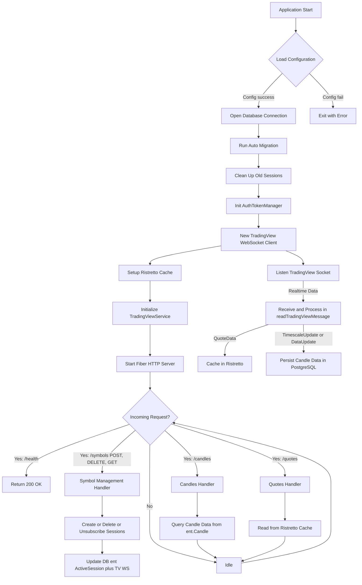

```mermaid
flowchart TB
    A1[Application Start] --> A2{Load Configuration}
    A2 -->|Config success| A3[Open Database Connection]
    A2 -->|Config fail| E[Exit with Error]
    A3 --> A4[Run Auto Migration]
    A4 --> A5[Clean Up Old Sessions]

    A5 --> A6[Init AuthTokenManager]
    A6 --> A7[New TradingView WebSocket Client]
    A7 --> A8[Setup Ristretto Cache]

    A8 --> A9[Initialize TradingViewService]
    A9 --> A10[Start Fiber HTTP Server]
    A10 --> B1{Incoming Request?}
    B1 -->|Yes: /health| B2[Return 200 OK]
    B1 -->|Yes: /symbols POST, DELETE, GET| B3[Symbol Management Handler]
    B1 -->|Yes: /candles| B4[Candles Handler]
    B1 -->|Yes: /quotes| B5[Quotes Handler]
    B1 -->|No| B6[Idle]

    B3 --> C1[Create or Delete or Unsubscribe Sessions]
    C1 --> C2[Update DB ent ActiveSession plus TV WS]
    B4 --> D1[Query Candle Data from ent.Candle]
    D1 --> B6
    B5 --> D2[Read from Ristretto Cache]
    D2 --> B6

    B6 --> B1

    A7 --> G1[Listen TradingView Socket]
    G1 -->|Realtime Data| G2[Receive and Process in readTradingViewMessage]
    G2 -->|QuoteData| G3[Cache in Ristretto]
    G2 -->|TimescaleUpdate or DataUpdate| G4[Persist Candle Data in PostgreSQL]
```